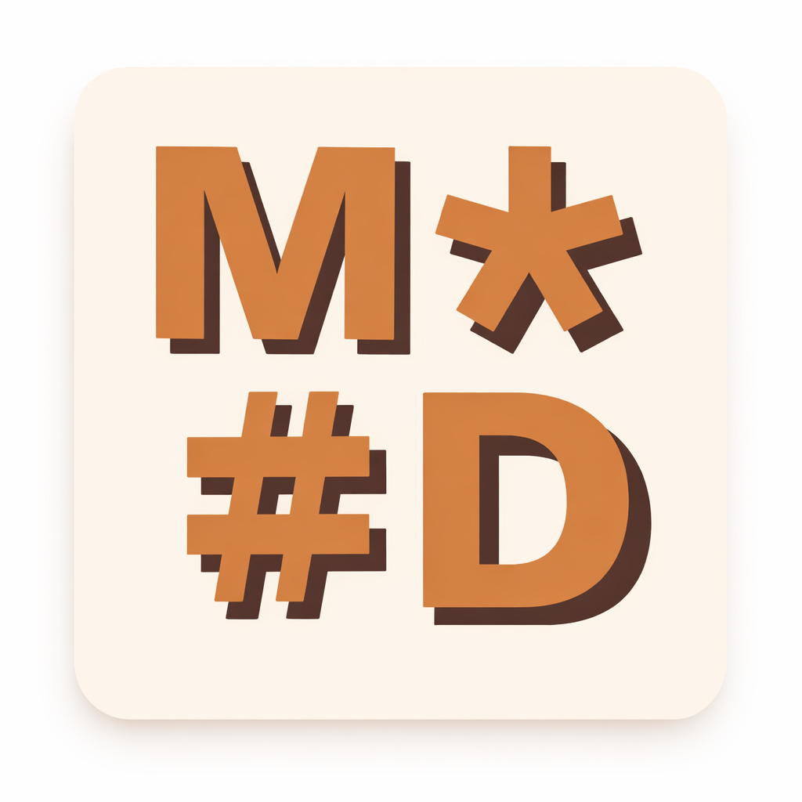

<p align="center">
  
</p>

<h1 align="center">MeetMarkdown</h1>

<p align="center">
  Free, open-source markdown tools that run entirely in your browser.<br/>
  No sign-up. No uploads. No tracking.
</p>

<p align="center">
  <a href="https://meetmarkdown.com">Website</a> &middot;
  <a href="https://github.com/buzagloidan/meetmarkdown/issues">Report Bug</a> &middot;
  <a href="https://github.com/buzagloidan/meetmarkdown/issues">Request Feature</a>
</p>

<p align="center">
  <a href="LICENSE"></a>
  <a href="https://github.com/buzagloidan/meetmarkdown/stargazers"></a>
</p>

---

## Why MeetMarkdown?

Most markdown tools either require an account, upload your files to a server, or are buried inside heavyweight apps. MeetMarkdown is different — everything runs **100% client-side** in your browser. Your content never leaves your device.

## Tools

| Tool | Description |
|------|-------------|
| **[Live Editor](https://meetmarkdown.com/editor)** | Real-time split/source/WYSIWYG editor with formatting toolbar, focus mode, and scroll sync |
| **[Formatter](https://meetmarkdown.com/tools/formatter)** | Auto-format and prettify markdown with Prettier |
| **[Markdown to HTML](https://meetmarkdown.com/tools/md-to-html)** | Convert markdown to clean, semantic HTML |
| **[HTML to Markdown](https://meetmarkdown.com/tools/html-to-md)** | Convert HTML back to markdown via Turndown |
| **[Table Formatter](https://meetmarkdown.com/tools/table-formatter)** | Align and beautify GFM tables |
| **[Markdown to PDF](https://meetmarkdown.com/tools/md-to-pdf)** | Export markdown as PDF via browser print |
| **[Word Count & Stats](https://meetmarkdown.com/tools/word-count)** | Reading time, headings, links, and more |
| **[Markdown Diff](https://meetmarkdown.com/tools/diff)** | Side-by-side comparison of two documents |
| **[URL to Markdown](https://meetmarkdown.com/tools/url-to-md)** | Fetch any public URL and convert to markdown |
| **[Mermaid to Image](https://meetmarkdown.com/tools/mermaid-to-image)** | Export Mermaid diagrams as PNG or JPG |
| **[GitHub Markdown Viewer](https://meetmarkdown.com/tools/github-viewer)** | Preview markdown exactly as GitHub renders it |

## Tech Stack

- **Framework** — [Next.js 16](https://nextjs.org/) with Turbopack
- **Language** — TypeScript
- **Styling** — [Tailwind CSS v4](https://tailwindcss.com/) + [shadcn/ui](https://ui.shadcn.com/)
- **Diagrams** — [Mermaid](https://mermaid.js.org/)
- **Math** — [KaTeX](https://katex.org/)
- **Formatting** — [Prettier](https://prettier.io/) (runs in-browser)

## Getting Started

### Prerequisites

- Node.js >= 20.9.0

### Installation

```bash
git clone https://github.com/buzagloidan/meetmarkdown.git
cd meetmarkdown
npm install
```

### Development

```bash
npm run dev
```

Open [http://localhost:3000](http://localhost:3000).

### Build

```bash
npm run build
```

## Environment Variables

Copy `.env.example` to `.env.local`:

```bash
cp .env.example .env.local
```

| Variable | Description | Required |
|----------|-------------|----------|
| `CONTACT_EMAIL` | Email address for the contact form | Optional |
| `RESEND_API_KEY` | [Resend](https://resend.com/) API key for sending contact emails | Optional |

> The app works fully without these — they only power the contact form.

## Contributing

Contributions are welcome! Please read the [Contributing Guide](CONTRIBUTING.md) and our [Code of Conduct](CODE_OF_CONDUCT.md) before getting started.

## License

Distributed under the MIT License. See [LICENSE](LICENSE) for details.

---

<p align="center">
  Made with ♥ by <a href="https://github.com/buzagloidan">Idan Buzaglo</a>
</p>
